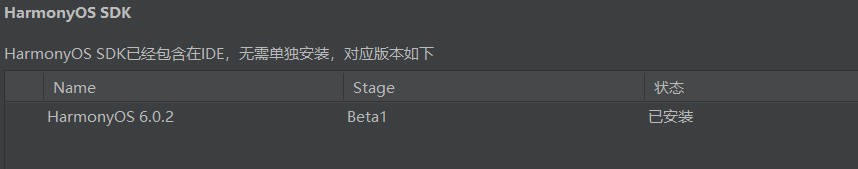
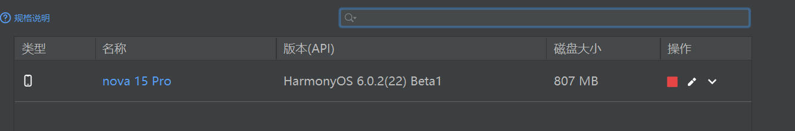
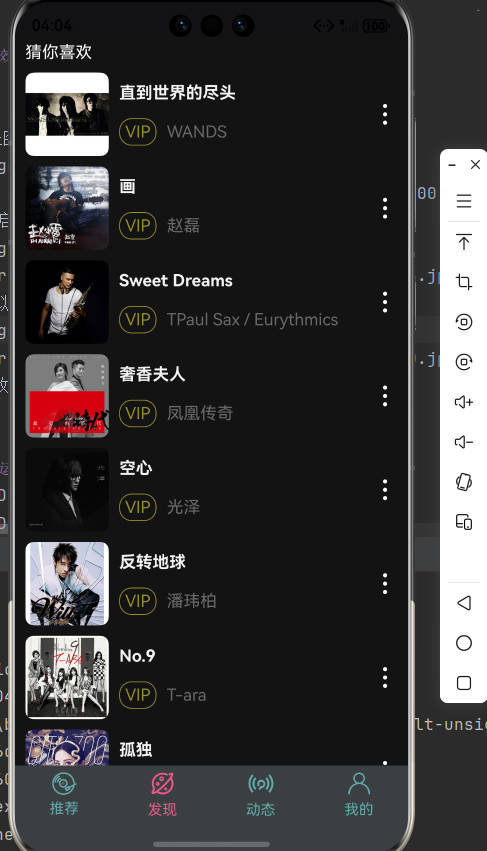
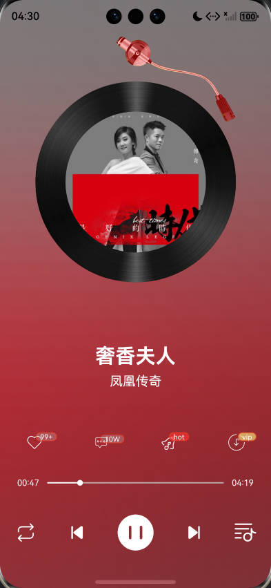
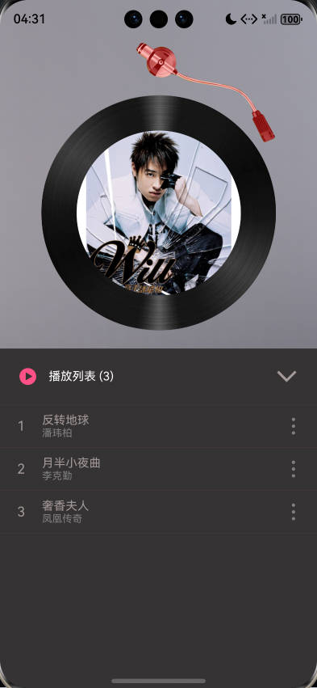

# 🎵 HMMusic  
> 黑马云音乐 · 鸿蒙 Next 原生应用 | DevEco SDK 6.0.2(22)

  
  


---

## 1. 效果速览


<!-- 竖图单列展示（更清楚） -->
<p align="center">
  <br>
  <em>启动页</em><br><br>
<p align="center">
<br>
<em>模拟器配置</em><br><br>
</p>


| 推荐页面 | 发现页面 | 动态页面 |
| --- | --- | --- |
|  |  |  |


| 播放页面                                        | 播放页面                                         | 歌单页面                                         |
|---------------------------------------------|----------------------------------------------|----------------------------------------------|
|  |  |  |

## 2. 运行前必做
1. **IDE**：DevEco Studio 5.0.3 及以上  
2. **SDK**：OpenHarmony API ≥ 12（本次使用 6.0.2+）  
3. **设备**：  
   - 真机：HarmonyOS NEXT DP 版  
   - 模拟器：Phone → API12 → 1080×2340  


## 3. 快速开始 
```bash

git clone https://github.com/nyzhhd/HMMusic.git
cd HMMusic
# 用 DevEco 打开根目录，等待 Sync 完成
# 顶部工具栏 → Run → 选择模拟器或真机
```

---

## 4. 核心功能一览
| 模块 | 关键技术点 | 备注 |
| --- | --- | --- |
| 🚀 路由跳转 | `NavPathStack` + `NavDestination` | 全局单例 `pathStack` 统一管理 |
| 🖼️ 轮播图 | `Swiper` + `.autoPlay(true)` | 3 s 自动切换，支持手势滑动 |
| 📃 横向歌单列表 | `List` + `Axis.Horizontal` | 关闭滚动条，滑动阻尼自适应 |
| ➕ 叠加布局 | `Stack` + `alignContent` | 封面 + 遮罩 + 播放按钮三层叠加 |
| ▶️ 音频播放 | `AVPlayer` | 状态机 + 时长回调 + 一键 `reset/release` |
| 📡 后台播控 | `AVSession` | 申请长时任务，锁屏歌词/播放状态同步 |
| 🌍 全局状态 | `AppStorageV2` | 跨 UI 实例共享当前歌曲、播放模式 |

---

## 5. 代码片段
### 5.1 路由跳转
```ts
@Entry
@Component
struct Index {
  @Provide('pathStack') pathStack: NavPathStack = new NavPathStack();

  aboutToAppear() {
    // 2 s 后自动进首页
    setTimeout(() => {
      this.pathStack.pushPath({ name: 'main' });
    }, 2000);
  }
}
```

### 5.2 轮播图
```ts
Swiper() {
  ForEach(this.banners, img => Image(img).width('100%'))
}
.autoPlay(true)
.interval(3000)
.indicator(true)
```

### 5.3 AVPlayer 封装
```ts
let player = await media.createAVPlayer();
player.on('stateChange', (state) => {
  if (state === 'completed') player.reset();
});
```

---

## 6. 项目结构
```
HMMusic
├─ entry/src/main/ets
│  ├─ pages              // 路由页面
│  ├─ components         // 可复用组件
│  ├─ model              // 实体 & 全局状态
│  └─ utils              // AVPlayer/AVSession 封装
├─ resources             // 静态资源、图标
└─ picture               // README 截图
```

---

## 7. 后续计划
- [ ] 歌词滚动同步
- [ ] 缓存策略 + 弱网播放
- [ ] 深色模式适配
- [ ] 桌面卡片 & 播控胶囊

---

## 8. 贡献指南
欢迎 Issue / PR！  
代码风格：项目已内置 `.prettierrc` & `eslintrc`，提交前执行
```bash
hvigorw lint
```

---

## 9. 许可证
MIT © 2026 HMMusic Contributors
```

使用说明  
1. 把上面整段复制到 `README.md` 即可生效。  
2. 如果图片路径或名称不同，只需批量替换 `./picture/` 路径。  
3. 想再“炫一点”，可在最顶部加一段 15 s 的 GIF 演示（``），替换掉静态截图。